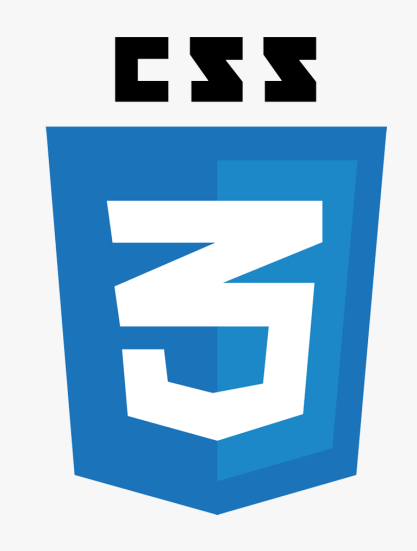
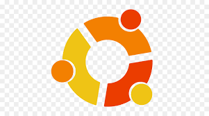

<h1 align="center">Hi there👋, I'm Ethan</h1>
<h2 align="center">Hi, I'm Ethan Huang, a passionate fourth-year Computer Science student at   University of California, San Diego.</h3>

## 🎈 My Value
- Keep beginner's mindset and curiosity.  
- Share anything that I learn.

## ⛳ My Goal of 2021
- Learn consistently and keep writing study notes.  
- Contribute more to open source community.

## 🧠 What I'm currently learning
- Frontend Web Development: Javascript, CSS, HTML, Typescript
- Agile Software Development
- Data Mining And Visualization with Python

## Languages and Tools
<code></code>
<code></code>
<code></code>
<code></code>
<code></code>
<code></code>
<code></code>
<code></code>
<code></code>
<code></code>
<code></code>
<code></code>
<code></code>
<code></code>
<code></code>

<code>
  
</code>

<code>
  
</code>
